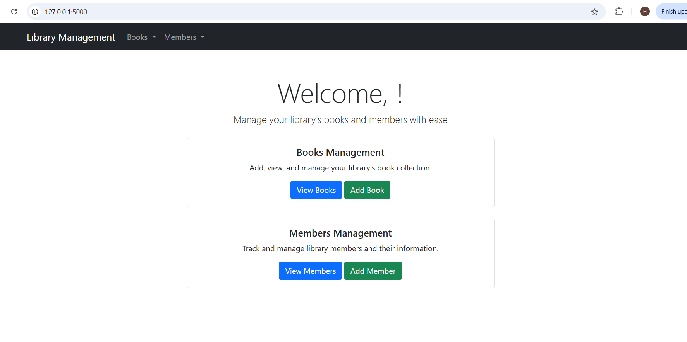
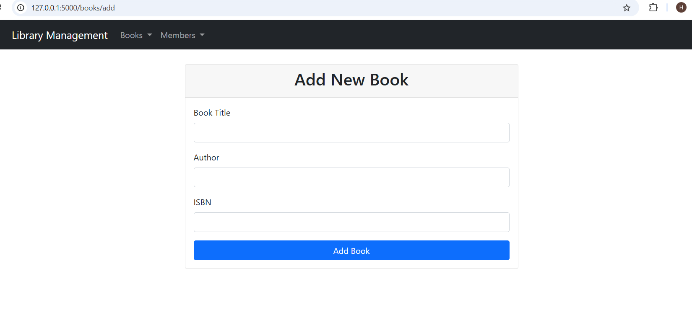
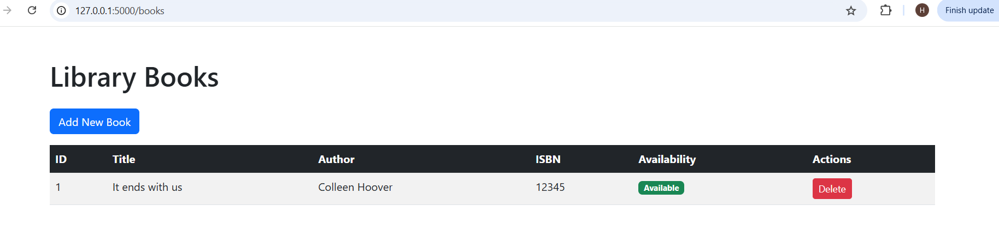
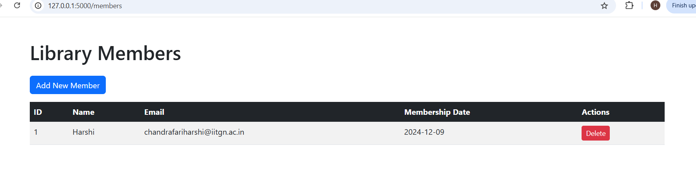
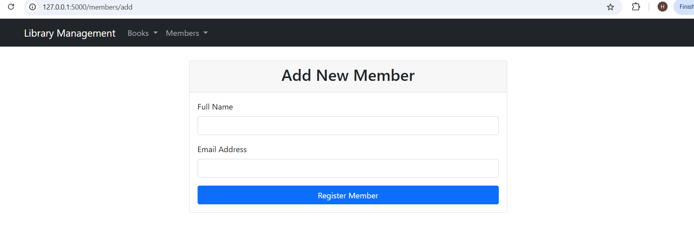

# Library Management Web Application

This is a Flask-based web application for user authentication and library management with SQLite database integration.

## Features
- Update
- Add books and members
- Delete books and members

## Prerequisites
- Python 3.8+
- Flask
- Flask-SQLAlchemy
- Flask-Bcrypt
- Flask-CORS

## Installation
1. Clone the repository
2. Create a virtual environment
3. Install dependencies by running
```bash
pip install -r requirements.txt
```
   


## Running the Application
```bash
python app.py
```

## Project Structure
- `app.py`: Main application file
- `library.db`: SQLite database
- `templates/`: HTML templates for different routes

  
## Screeshots of Application










## Troubleshooting
- Delete `library.db` to reset database
I tried implementing authentication but was facing some issues, but I can do it with some more time.
